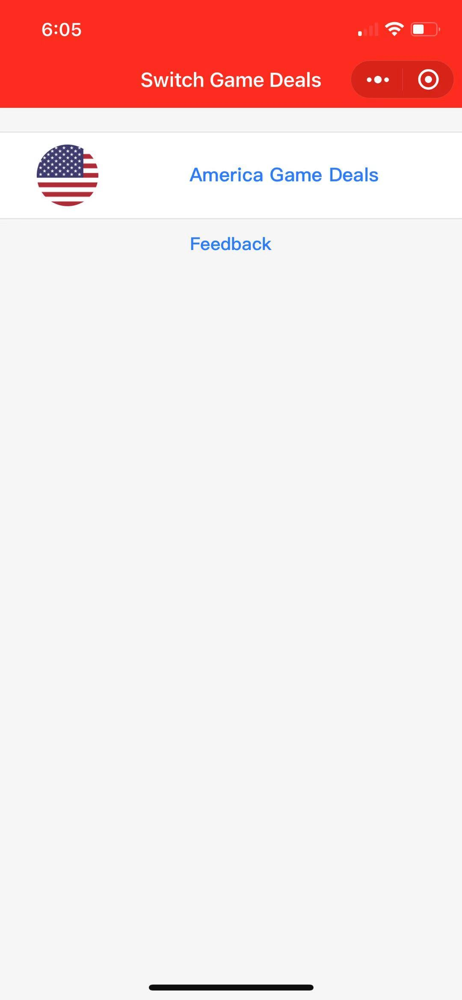
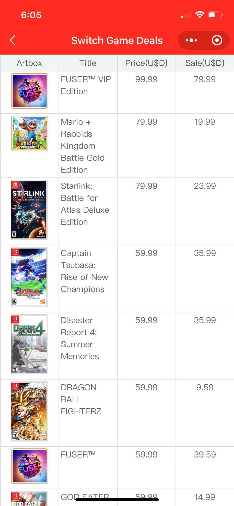

# Wechat Mini Program - Nintendo Switch Game Deals
A mini program that can help user browse the great deal games on Nintendo Switch through WeChat, withou bothering openning Nintendo Switch E-shop.
Currently, only America games are supported

## Backend:
Powerd by Heroku, with code provided by https://github.com/Iseiju/nintendo-eshop-sales and https://github.com/lmmfranco/nintendo-switch-eshop
Currently, the backend API is https://switch-game-deals.herokuapp.com/games/eshop-sales

## Frontend:
Powerd by Wechat mini program
[Wechat Mini Program document](https://developers.weixin.qq.com/miniprogram/dev/wxcloud/basis/getting-started.html)

## Demos:

